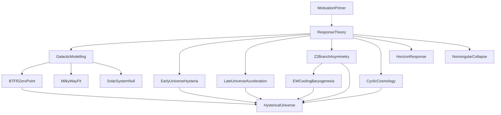

# Hysterical Response

Open quantum systems with incoming matter are driven:

$$
\dot\rho = \mathcal{L}\rho + \mathcal{S}
$$

The **hysteric response** is the off-diagonal part of a force observable under that drive:

$$
F_H = -\mathrm{Tr}\bigl(F\,\mathcal{L}^{-1}\mathcal{S}\bigr)
$$

No new mediator is added: $F_H$ is a component of the response of an already-existing interaction $F$.

## Universality

The same construction applies to every interaction once it is written as $(F,\mathcal{L},\mathcal{S})$. There is no proliferating family of microscopic “Hysteria fields”; whether a channel is neutralized, critical, or unstable is decided by susceptibility and closed-loop dynamics.

## Main results

- **Neutrality Theorem** — under controlled susceptibility, ordinary neutrality of an interaction implies neutralization of its hysteric response.
- **Gravitational positivity** — gravity need not neutralize; a stable supercritical saturated node can carry a positive leftover response.
- **Hysterical Instability (Hysteria)** — when closed-loop gain crosses unity, an odd collective mode goes supercritical (pitchfork / branch selection).
- **Spontaneous symmetry breaking** — a conjugation $\mathbb{Z}_2$ can break spontaneously under Hysteria, with concurrent odd portals converting the breaking into branch-conditioned asymmetries.

These drafts are AI-assisted at this stage; theorems are accompanied by Lean implementations. Synopses give a proof-free skim of each technical paper. Material will be updated and eventually published in human-written form.

## Papers

| Paper | What it is for |
|-------|----------------|
| **Motivation (primer)** | Conceptual setup: why an open-system response appears, without the theorem package. |
| **Hysterical Response** | Core open-system theory: $F_H$, neutrality, gravitational survival, and Hysteria. |
| **Galactic Modelling** | Response halo and galactic scaling (BTFR, size–mass, oblate geometry). |
| **BTFR Zero Point** | Cosmological-horizon memory fixing the BTFR zero point $a_0=H_0 c/2\pi$. |
| **Milky Way Fit** | Milky Way realization / fit of the response halo. |
| **Solar-System Null Test** | Local null test of the response against solar-system constraints. |
| **Early-Universe Hysteria** | Early-universe specialization of Hysterical Instability (timing / growth). |
| **Late-Universe Acceleration** | Late-universe acceleration / attractor from hysterical response. |
| **Z₂ Branch Asymmetry** | Master branch-asymmetry theorem and catalogue of odd channels. |
| **Cyclic Cosmology** | Hysterical conformal cyclic cosmology and active IR crossover. |
| **Horizon Response** | Horizon hysterical response / Hawking–Tolman package. |
| **Nonsingular Collapse** | Nonsingular gravitational collapse via Hysteria / remnant. |
| **EW Cooling Baryogenesis** | Cooling-universe electroweak concurrency ⇒ asymmetric baryogenesis. |
| **Hysterical Universe** | Qualitative cycle stitching the technical companions together. |

*(Two earlier specialized asymmetry companions are archived; their live content lives in **Z₂ Branch Asymmetry** and **EW Cooling Baryogenesis**.)*

## Dependency chain

